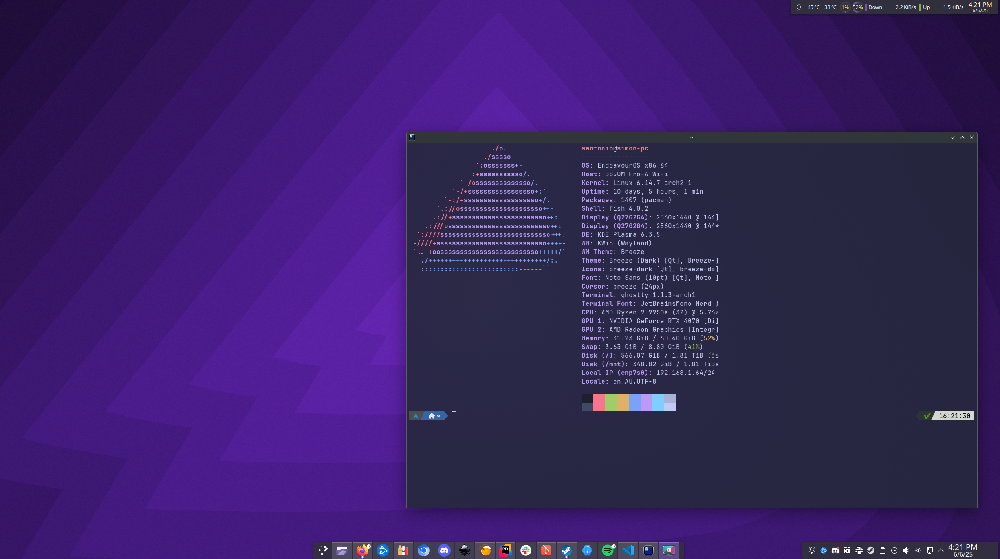

# kde-konsave-profile
Basic KDE Profile for use with [konsave](https://github.com/Prayag2/konsave)

(where not avialble in package manager run steps 1-4
1. `python -m venv ~/python`
1. `source ~/python/`
1. `python -m pip install konsave`
1. `pip install setuptools`
1. Move `basic.knsv` into ~/
1. `konsave -i ~/basic.knsv`
1. Run `konsave -a basic`

